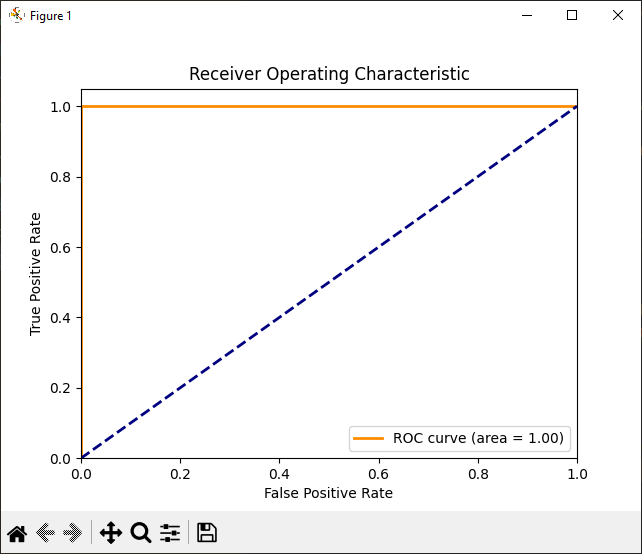

# IsEven ML
A PyTorch classification model to determine if a number is odd or even.

## How Do I Use This?
1. First, install the requirements with `pip install -r requirements.txt`.
2. Next, check if you have a GPU by running `test-cuda.py`. If you have a GPU, the training process will be much faster.
3. Next, add test data to `test_data.csv`. The model only works on natural numbers up to $2^{64}-1$ and 0.
4. Then, execute `main.py`. This will use `iseven-ml.pth`, delete this file if you'd like to train the model from scratch.
5. To test the model, run `test.py`.

## Tweaking Parameters
You can tweak the number of epochs that the model is trained on in `main.py`. Modify the `num_epochs` variable. Ensure that you delete `iseven-ml.pth` afterwards to re-generate the model.

## How Does It Work?
The dataset is 2049 integers randomly selected from between 1 and 65535. 1024 odd numbers, 1024 even numbers, and zero. The odd numbers are labelled 1, and the even numbers are labelled 0. Before training, the numbers are converted to a binary representation.

## Gallery

